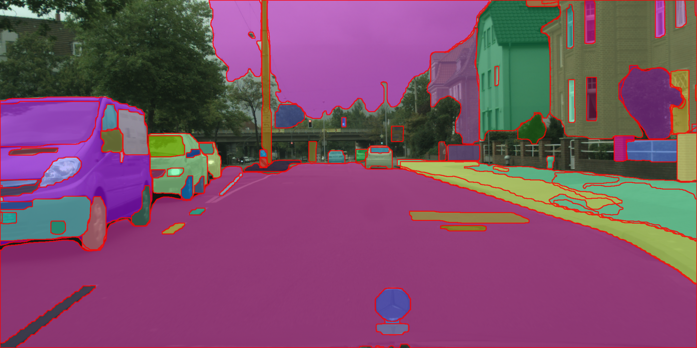
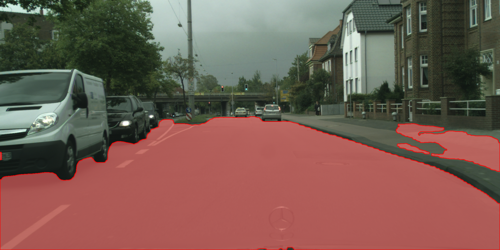
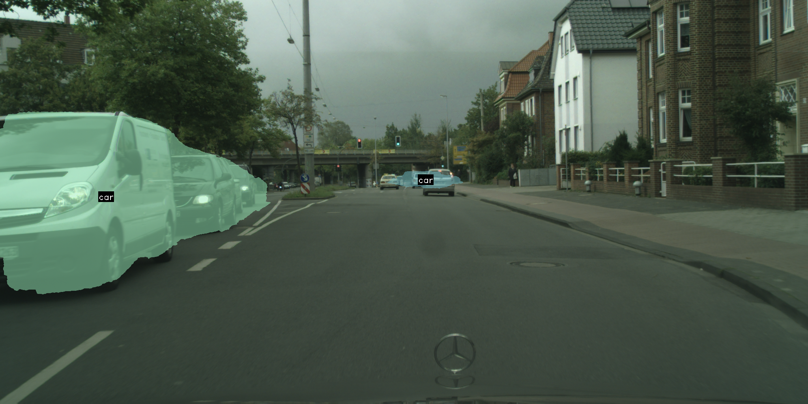
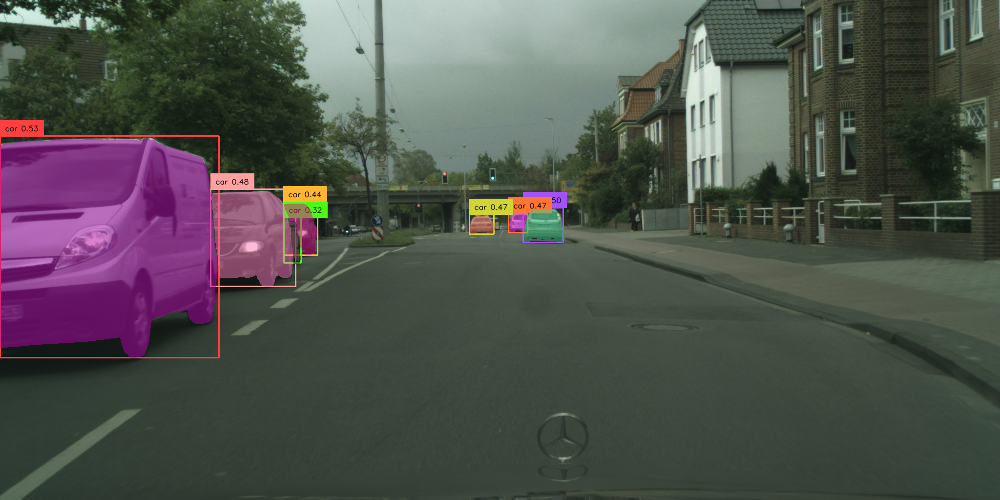
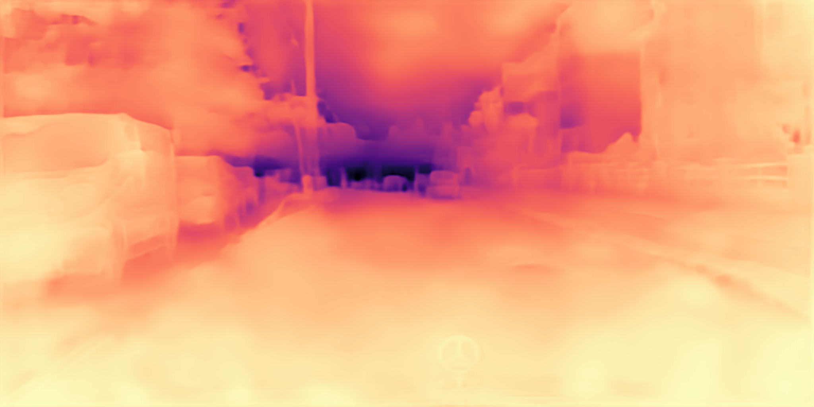

## Todo
- [x] Modify all function calls to be the same as OneFormer
- [ ] Add SAM and HQ-SAM
- [ ] Support DINOSeg with FastSAM and HQ-SAM
- [x] Create a Colab demo
- [ ] Add a function to utils for obtaining bbox from mask

## Prerequisites

Before you begin, ensure you have met the following requirements:

- **Operating System**: Linux
- **Python Version**: 3.10
- **CUDA Version**: 12.1

Additionally, you will need the following packages:

- **PyTorch**: 2.1.0
- **Torchvision**: 0.16.0

For detailed installation instructions for PyTorch and Torchvision, refer to the [PyTorch previous versions documentation](https://pytorch.org/get-started/previous-versions/#v210).

### Installation Commands
Install segment_tools using the following commands:

```bash
pip install git+https://github.com/qwertyroiro/segment_tools.git
```

Ensure all the prerequisites are properly installed to avoid any compatibility issues during the setup process.

[Colab Demo](segment_tools_demo.ipynb)
## Usage

### Image Preparation
```python
from PIL import Image
import numpy as np
import segment_tools as st

image_path = "cityscapes.jpg"
image_pil = Image.open(image_path)  # Open image with Pillow
image_np = np.array(image_pil)      # Convert to numpy array
```

### Managing Log Verbosity(Optional)
```python
import logging
logging.getLogger("fvcore").setLevel(logging.ERROR)
logging.getLogger("detectron2").setLevel(logging.ERROR)
logging.getLogger("ultralytics").setLevel(logging.ERROR)
logging.getLogger("dinov2").setLevel(logging.ERROR)
```

### Define Prompt
```python
prompt = "car"  # Define your prompt
```

## Segment Tools Usage

### 1. FastSAM

#### Without Prompt

```python
fastsam = st.FastSAM()
result = fastsam.run(image_np)
if result is not None:
    image, ann = result["image"], result["mask"]
```

#### With prompt

```python
fastsam = st.FastSAM()
result = fastsam.run(image_np, prompt)
if result is not None:
    image, ann = result["image"], result["mask"]
```

#### Additional Notes
- For FastSAM, the `ann` (annotation) format is such that non-mask areas are represented by 0 and mask areas are represented by 1.

### 2. CLIPSeg
#### With prompt

```python
clipseg = st.CLIPSeg()
result = clipseg.run(image_np, prompt)
if result is not None:
    image, ann = result["image"], result["mask"]
```
#### Additional Notes
- For CLIPSeg, the `ann` (annotation) format is such that non-mask areas are represented by 0 and mask areas are represented by 1.

### 3. DINO
#### With prompt

```python
dino = st.DINO()
result = dino.run(image_np, prompt)
if result is not None:
    image, bbox = result["image"], result["bbox"]
```

### 4. DINOSeg
#### With prompt

```python
dinoseg = st.DINOSeg(sam_checkpoint="vit_h")
result = dinoseg.run(image_np, prompt)
if result is not None:
    image, ann = result["image"], result["mask"]
```
#### Additional Notes
- For DINOSeg, the `ann` (annotation) format is such that non-mask areas are represented by 0 and mask areas are represented by 1.

### 5. OneFormer Variants

### 5.1 OneFormer (ADE20K Dataset)
#### Without prompt (Backbone: DiNAT)
.png)
```python
oneformer_ade20k = st.OneFormer(dataset="ade20k")
result = oneformer_ade20k.run(image_np)
if result is not None:
    image, ann, info = result["image"], result["mask"], result["info"]
```
#### With prompt (Backbone: DiNAT)
(prompt).png)
```python
oneformer_ade20k = st.OneFormer(dataset="ade20k")
result = oneformer_ade20k.run(image_np, prompt)
if result is not None:
    image, ann = result["image"], result["mask"]
```

#### Without prompt (Backbone: Swin)
```python
oneformer_ade20k_swin = st.OneFormer(dataset="ade20k", backbone="swin")
result = oneformer_ade20k_swin.run(image_np)
if result is not None:
    image, ann, info = result["image"], result["mask"], result["info"]
```

#### With prompt (Backbone: Swin)
```python
oneformer_ade20k_swin = st.OneFormer(dataset="ade20k", backbone="swin")
result = oneformer_ade20k_swin.run(image_np, prompt)
if result is not None:
    image, ann = result["image"], result["mask"]
```
#### Without prompt (Backbone: ConvNeXt)
```python
oneformer_ade20k_convnext = st.OneFormer(dataset="ade20k", backbone="convnext")
result = oneformer_ade20k_convnext.run(image_np)
if result is not None:
    image, ann, info = result["image"], result["mask"], result["info"]
```

#### With prompt (Backbone: ConvNeXt)
```python
oneformer_ade20k_convnext = st.OneFormer(dataset="ade20k", backbone="convnext")
result = oneformer_ade20k_convnext.run(image_np, prompt)
if result is not None:
    image, ann = result["image"], result["mask"]
```

### 5.2 OneFormer (Cityscapes Dataset)
#### Without prompt (Backbone: DiNAT)
.png)
```python
oneformer_city = st.OneFormer(dataset="cityscapes")
result = oneformer_city.run(image_np)
if result is not None:
    image, ann, info = result["image"], result["mask"], result["info"]
```
#### With prompt (Backbone: DiNAT)
(prompt).png)
```python
oneformer_city = st.OneFormer(dataset="cityscapes")
result = oneformer_city.run(image_np, prompt)
if result is not None:
    image, ann = result["image"], result["mask"]
```
#### Without prompt (Backbone: Swin)
```python
oneformer_city_swin = st.OneFormer(dataset="cityscapes", backbone="swin")
result = oneformer_city_swin.run(image_np)
if result is not None:
    image, ann, info = result["image"], result["mask"], result["info"]
```
#### With prompt (Backbone: Swin)
```python
oneformer_city_swin = st.OneFormer(dataset="cityscapes", backbone="swin")
result = oneformer_city_swin.run(image_np, prompt)
if result is not None:
    image, ann = result["image"], result["mask"]
```
#### Without prompt (Backbone: ConvNeXt)
```python
oneformer_city_convnext = st.OneFormer(dataset="cityscapes", backbone="convnext")
result = oneformer_city_convnext.run(image_np)
if result is not None:
    image, ann, info = result["image"], result["mask"], result["info"]
```
#### With prompt (Backbone: ConvNeXt)
```python
oneformer_city_convnext = st.OneFormer(dataset="cityscapes", backbone="convnext")
result = oneformer_city_convnext.run(image_np, prompt)
if result is not None:
    image, ann = result["image"], result["mask"]
```

### 5.3 OneFormer (COCO Dataset)
#### Without prompt (Backbone: DiNAT)
.png)
```python
oneformer_coco = st.OneFormer(dataset="coco")
result = oneformer_coco.run(image_np)
if result is not None:
    image, ann, info = result["image"], result["mask"], result["info"]
```
#### With prompt (Backbone: DiNAT)
(prompt).png)
```python
oneformer_coco = st.OneFormer(dataset="coco")
result = oneformer_coco.run(image_np, prompt)
if result is not None:
    image, ann = result["image"], result["mask"]
```
#### Without prompt (Backbone: Swin)
```python
oneformer_coco_swin = st.OneFormer(dataset="coco", backbone="swin")
result = oneformer_coco_swin.run(image_np)
if result is not None:
    image, ann, info = result["image"], result["mask"], result["info"]
```
#### With prompt (Backbone: Swin)
```python
oneformer_coco_swin = st.OneFormer(dataset="coco", backbone="swin")
result = oneformer_coco_swin.run(image_np, prompt)
if result is not None:
    image, ann = result["image"], result["mask"]
```

### 5.4 OneFormer (Mapillary Vistas Dataset)
#### Without prompt (Backbone: DiNAT)
<!-- .png) -->
```python
oneformer_vistas = st.OneFormer(dataset="vistas")
result = oneformer_vistas.run(image_np)
if result is not None:
    image, ann, info = result["image"], result["mask"], result["info"]
```
#### With prompt (Backbone: DiNAT)
<!-- (prompt).png) -->
```python
oneformer_vistas = st.OneFormer(dataset="vistas")
result = oneformer_vistas.run(image_np, prompt)
if result is not None:
    image, ann = result["image"], result["mask"]
```
#### Without prompt (Backbone: Swin)
```python
oneformer_vistas_swin = st.OneFormer(dataset="vistas", backbone="swin")
result = oneformer_vistas_swin.run(image_np)
if result is not None:
    image, ann, info = result["image"], result["mask"], result["info"]
```
#### With prompt (Backbone: Swin)
```python
oneformer_vistas_swin = st.OneFormer(dataset="vistas", backbone="swin")
result = oneformer_vistas_swin.run(image_np, prompt)
if result is not None:
    image, ann = result["image"], result["mask"]
```
#### Without prompt (Backbone: ConvNeXt)
```python
oneformer_vistas_convnext = st.OneFormer(dataset="vistas", backbone="convnext")
result = oneformer_vistas_convnext.run(image_np)
if result is not None:
    image, ann, info = result["image"], result["mask"], result["info"]
```
#### With prompt (Backbone: ConvNeXt)
```python
oneformer_vistas_convnext = st.OneFormer(dataset="vistas", backbone="convnext")
result = oneformer_vistas_convnext.run(image_np, prompt)
if result is not None:
    image, ann = result["image"], result["mask"]
```

#### Additinal Notes
- The `run` method can be called with or without a prompt for all OneFormer variants.
- For OneFormer **without a prompt**, the `info` variable contains information about the segmented objects. Each entry in `info` includes details such as `id`, `isthing`, `category_id`, `area`, and `class`. The `ann` (annotation) format is such that non-mask areas are represented by 0. 
- For OneFormer **with a prompt**, the `ann` (annotation) format is such that mask areas are represented by 1 and non-mask areas are represented by 0.
- There is no convnext as backbone in the coco dataset.

### 6. Depth Anything

```python
depth_any = st.Depth_Anything(encoder="vitl") # vits or vitb or vitl
result = depth_any.run(image)
if result is not None:
    depth_img, depth = result["image"], result["depth"]
```

### 7. DINOv2 (depth estimation) (CPU is not supported)

```python
depth_dino = st.DINOv2_depth(BACKBONE_SIZE="base") # small, base, large, giant
result = depth_dino.run(image)
if result is not None:
    depth_img, depth = result["image"], result["depth"]
```

### 8. DepthPro
```python
depth_pro = st.Depth_Pro()
result = depth_pro.run(image)
if result is not None:
    depth_img, depth = result["image"], result["depth"]
```

### 9. SAM2

#### Image
```python
sam2 = st.SAM2(model_size="base") # tiny, small, base, large
result = sam2.run(image, point=..., point_label=..., bbox=..., mask=..., multimask_output=True/False)
if result is not None:
    image, ann = result["image"], result["masks"]
```

#### Video
```python
sam2 = st.SAM2(model_size="base") # tiny, small, base, large
result = sam2.run_video(video_path, start_frame=0, end_frame=None, point=..., point_label=..., bbox=..., mask=..., temp_dir=...)
if result is not None:
    out_video_path, ann = result["video"], result["masks"]
```

#### Image(Gradio)
```python
sam2 = st.SAM2(model_size="base") # tiny, small, base, large
sam2.run_gradio(server_port=7860)
```

#### Video(Gradio)
```python
sam2 = st.SAM2(model_size="base") # tiny, small, base, large
sam2.run_video_gradio(server_port=7860)
```

### Additional Notes
- The `image` and `ann` (annotations) are obtained from the `result` dictionary, which is the output from the segmentation models.
- If `result` is `None`, it indicates that the process was not successful. This could be due to various reasons such as incorrect input data or model limitations. It is important to handle this case in your code to avoid errors.


## Modifications and Build Information

This project includes modified versions of the following third-party libraries:

1. **Detectron2** (Apache 2.0 License)
   - Repository: [https://github.com/facebookresearch/detectron2](https://github.com/facebookresearch/detectron2)
   - Build: The source code has been built and the resulting binary files are available in the [Releases](https://github.com/qwertyroiro/segment_tools/releases) section.

2. **GroundingDINO** (Apache 2.0 License)
   - Repository: [https://github.com/IDEA-Research/GroundingDINO](https://github.com/IDEA-Research/GroundingDINO)
   - Build: The source code has been built and the resulting binary files are available in the [Releases](https://github.com/qwertyroiro/segment_tools/releases) section.

3. **CLIP** (MIT License)
   - Repository: [https://github.com/openai/CLIP](https://github.com/openai/CLIP)
   - Build: The source code has been built and the resulting binary files are available in the [Releases](https://github.com/qwertyroiro/segment_tools/releases) section.

4. **NATTEN** (MIT License)
   - Repository: [https://github.com/SHI-Labs/NATTEN](https://github.com/SHI-Labs/NATTEN)
   - Build: The source code has been built and the resulting binary files are available in the [Releases](https://github.com/qwertyroiro/segment_tools/releases) section.


### License
This project is licensed under the MIT License. See the [LICENSE](LICENSE) file for details.

### Third-Party Licenses
This project includes third-party software licensed under the Apache License 2.0 and the MIT License.
- Detectron2: [Apache License 2.0](https://github.com/facebookresearch/detectron2/blob/main/LICENSE)
- GroundingDINO: [Apache License 2.0](https://github.com/IDEA-Research/GroundingDINO/blob/main/LICENSE)
- CLIP: [MIT License](https://github.com/openai/CLIP/blob/main/LICENSE)
