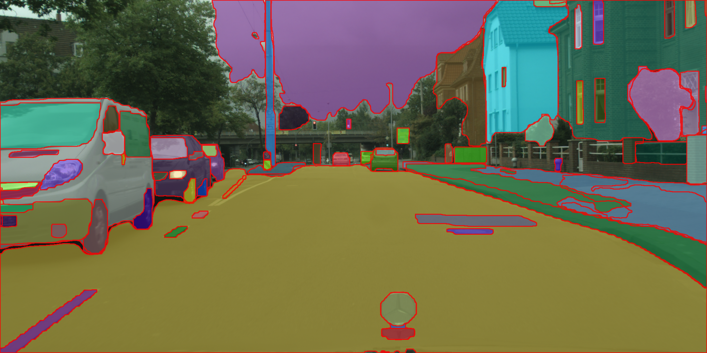

## Todo
- [ ] Modify all function calls to be the same as OneFormer
- [ ] Add SAM and HQ-SAM
- [ ] Support DINOSeg with FastSAM and HQ-SAM
- [ ] Create a Colab demo
- [ ] Add a function to utils for obtaining bbox from mask

## Prerequisites

Before you begin, ensure you have met the following requirements:

- **Operating System**: Linux
- **Python Version**: 3.10
- **CUDA Version**: 12.1

Additionally, you will need the following packages:

- **PyTorch**: 2.1.0
- **Torchvision**: 0.16.0
- **Wheel**: 0.42.0

For detailed installation instructions for PyTorch and Torchvision, refer to the [PyTorch previous versions documentation](https://pytorch.org/get-started/previous-versions/#v210).

### Installation Commands

First, install the specific version of Wheel:

```bash
pip install wheel==0.42.0
```

Next, install PyTorch and Torchvision using the following commands:

```bash
pip install torch==2.1.0 torchvision==0.16.0 --index-url https://download.pytorch.org/whl/cu121
```

For additional tools and libraries, execute:

```bash
pip install git+https://github.com/qwertyroiro/segment_tools.git
pip install natten==0.15.1 -f https://shi-labs.com/natten/wheels/cu121/torch2.1.0/index.html
```

Ensure all the prerequisites are properly installed to avoid any compatibility issues during the setup process.
## Usage

### Image Preparation
```python
from PIL import Image
import numpy as np
import segment_tools as st

image_path = "cityscapes.jpg"
image_pil = Image.open(image_path)  # Open image with Pillow
image_np = np.array(image_pil)      # Convert to numpy array
```

### Managing Log Verbosity(Optional)
```python
import logging
logging.getLogger("fvcore").setLevel(logging.ERROR)
logging.getLogger("detectron2").setLevel(logging.ERROR)
logging.getLogger("ultralytics").setLevel(logging.ERROR)
logging.getLogger("dinov2").setLevel(logging.ERROR)
```

### Define Prompt
```python
prompt = "car"  # Define your prompt
```

### Segment Tools Usage

### FastSAM


```python
# Segment without prompt
fastsam = st.FastSAM()
result = fastsam.run(image_np)
if result is not None:
    image, ann = result["image"], result["mask"]

# Segment with prompt
fastsam = st.FastSAM()
result = fastsam.run(image_np, prompt)
if result is not None:
    image, ann = result["image"], result["mask"]
```

### CLIPSeg

```python
clipseg = st.CLIPSeg()
result = clipseg.run(image_np, prompt)
if result is not None:
    image, ann = result["image"], result["mask"]
```

### DINO

```python
dino = st.DINO()
result = dino.run(image_np, prompt)
if result is not None:
    image, bbox = result["image"], result["bbox"]
```

### DINOSeg

```python
dinoseg = st.DINOSeg(sam_checkpoint="vit_h")
result = dinoseg.run(image_np, prompt)
if result is not None:
    image, ann = result["image"], result["mask"]
```

### OneFormer Variants

#### OneFormer (ADE20K Dataset)
.png)
(prompt).png)
```python
oneformer_ade20k = st.OneFormer(dataset="ade20k")
result = oneformer_ade20k.run(image_np)
if result is not None:
    image, ann = result["image"], result["mask"]

# With SWIN Transformer
oneformer_ade20k_swin = st.OneFormer(dataset="ade20k", use_swin=True)
result = oneformer_ade20k_swin.run(image_np)
if result is not None:
    image, ann = result["image"], result["mask"]

# Using prompt
result = oneformer_ade20k.run(image_np, prompt)
if result is not None:
    image, ann = result["image"], result["mask"]
result = oneformer_ade20k_swin.run(image_np, prompt)
if result is not None:
    image, ann = result["image"], result["mask"]
```

#### OneFormer (Cityscapes Dataset)
.png)
(prompt).png)
```python
oneformer_city = st.OneFormer(dataset="cityscapes")
result = oneformer_city.run(image_np)
if result is not None:
    image, ann = result["image"], result["mask"]

# With SWIN Transformer
oneformer_city_swin = st.OneFormer(dataset="cityscapes", use_swin=True)
result = oneformer_city_swin.run(image_np)
if result is not None:
    image, ann = result["image"], result["mask"]

# Using prompt
result = oneformer_city.run(image_np, prompt)
if result is not None:
    image, ann = result["image"], result["mask"]
result = oneformer_city_swin.run(image_np, prompt)
if result is not None:
    image, ann = result["image"], result["mask"]
```

#### OneFormer (COCO Dataset)
.png)
(prompt).png)
```python
oneformer_coco = st.OneFormer(dataset="coco")
result = oneformer_coco.run(image_np)
if result is not None:
    image, ann = result["image"], result["mask"]

# With SWIN Transformer
oneformer_coco_swin = st.OneFormer(dataset="coco", use_swin=True)
result = oneformer_coco_swin.run(image_np)
if result is not None:
    image, ann = result["image"], result["mask"]

# Using prompt
result = oneformer_coco.run(image_np, prompt)
if result is not None:
    image, ann = result["image"], result["mask"]
result = oneformer_coco_swin.run(image_np, prompt)
if result is not None:
    image, ann = result["image"], result["mask"]
```

### Depth Anything

```python
depth_model = st.Depth_Anything(encoder="vitl") # vits or vitb or vitl
result = depth_model.run(image)
if result is not None:
    image, depth = result["image"], result["depth"]
```

### DINOv2 (depth estimation) (CPU is not supported)

```python
depth_model = st.DINOv2_depth(BACKBONE_SIZE="base") # small, base, large, giant
result = depth_model.run(image)
if result is not None:
    depth_img, depth = result["image"], result["depth"]
```

### Additional Notes
- The `run` method can be called with or without a prompt for all OneFormer variants.
- The `use_swin=True` parameter enables the use of the SWIN Transformer as the backbone for the OneFormer models.
- The `image` and `ann` (annotations) are obtained from the `result` dictionary, which is the output from the segmentation models.
- If `result` is `None`, it indicates that the segmentation process was not successful. This could be due to various reasons such as incorrect input data or model limitations. It is important to handle this case in your code to avoid errors.
